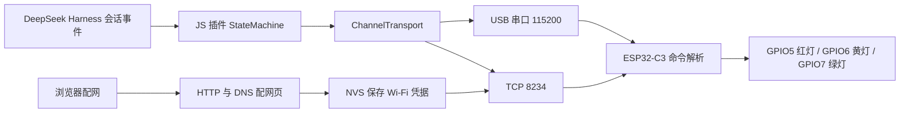

# 项目研究报告：ESP32-C3 DeepSeek Harness 状态灯

> 本文记录修复前的基线（Git 提交 `ce246c3`），问题、行号与“未执行”清单对应初始研究时点。当前 2.1.0 修复及验证结果见 [修复记录](docs/FIX_NOTES.md)，使用方法见 [README](README.md)。

研究日期：2026-10-07（Asia/Shanghai）。范围：当前工作区全部四个源文件、插件内存模拟与上游官方文档/源码。没有连接、刷写硬件，也没有修改原有代码。

## 1. 结论

这是一个将 DeepSeek Harness 的运行事件显示为红、黄、绿灯效的桌面外围设备项目。电脑端插件负责解释事件；ESP32-C3 负责接收命令、驱动三路 LED 和 Wi-Fi 配网。根据现有源码，主要功能已经实现，但尚不能认定为经过完整验证的稳定版本：事件语义、状态同步、配网扫描和断网恢复存在明确问题，且缺少构建与接线资料。

硬件端没有调用 DeepSeek 模型的代码，没有屏幕驱动；“显示器”在当前实现中具体指三色状态灯。固件内有 TCP/UDP 控制入口，HTTP 只用于配网，插件实际使用串口和 TCP。依据：[插件入口](./v2.0/plugin/lib/index.js)第901–933行；[固件](./v2.0/firmware/esp32c3_dsh_status_light/esp32c3_dsh_status_light.ino)第9–18、208–211、939–964行。

## 2. 项目构成

| 文件 | 作用 | 现状 |
| --- | --- | --- |
| `v2.0/plugin/package.json` | ESM 插件元数据、运行环境与依赖 | 版本2.0.0；Node >=20；serialport ^13.0.0；没有scripts |
| `v2.0/plugin/cordis.patch.yml` | 将插件插入 Cordis 配置 | 仅指定插件id/name，没有设备IP或端口配置示例 |
| `v2.0/plugin/lib/index.js` | 事件状态机、串口发现、TCP、通道选择、诊断 | 933行，导出__testing便于模拟 |
| `v2.0/firmware/esp32c3_dsh_status_light/esp32c3_dsh_status_light.ino` | 灯效、命令、配网、NVS、复位诊断 | 1395行；FW_VERSION仍为1.9.0 |

`downloads`目录为空。当前目录没有Git仓库、README、接线图、BOM、测试文件、依赖锁文件、PlatformIO配置或明确Arduino板型配置。以上基于全目录枚举；版本2.0.0与1.9.0不一致是可追溯性缺口，不能仅据此断定协议不兼容。

## 3. 工作链路与状态模型

插件监听`ctx.on('session/event', (_session, event) => ...)`；基础状态、计划模式和工具活动分别维护。工具调用、工作流、命令、压缩、hook尝试按ID成对跟踪。工具开始通常发送`thinking`和`tools on`，并没有自动切到`busy`。多个活动用Map/Set计数，避免第一个任务完成就关掉所有工具提示。依据：插件第61–106、616–709、901–922行。

| 命令/条件 | 固件灯效 | 插件触发 |
| --- | --- | --- |
| `off` | 全灭 | 初始化或目前映射的session/end-seed |
| `thinking` | 黄灯呼吸，周期2.4秒 | turn/start、step/start/end、assistant消息等 |
| `tools on` | thinking时绿灯与黄灯错相呼吸 | 存在活动工具/工作流/命令等 |
| `tools off` | 延迟2.4秒撤掉工具提示 | 全部跟踪活动结束 |
| `error` | 红灯常亮 | 重试事件或部分被识别的失败结果 |
| `alarm` | 黄灯快闪，140ms切换亮灭 | approval/asked |
| `success` | 绿灯常亮 | turn/end（当前未区分结束原因） |
| `plan` / `+plan` | 绿灯常亮，可叠加其他基础灯效 | plan/mode；绿灯常亮时工具绿灯呼吸不显示 |
| `notify [后续状态]` | 绿灯闪两次，共约600ms，再恢复/切换状态 | goal/change、sandbox/mode、退出计划模式等 |
| `busy` | 绿灯慢闪，600ms切换亮灭 | 固件支持，但当前正常事件路径不主动发送 |
| 配网模式 | 红灯慢闪 | 无凭据或启动连接失败等 |

依据：固件第30–45、228–305、497–565、576–580、1337–1363行；插件第720–820行。

## 4. 运行与硬件约束

- GPIO5/6/7分别接红/黄/绿，`ACTIVE_LOW=true`；源码预期共阳连接，公共端3V3，低电平点亮。GPIO4用INPUT_PULLUP作模式开关，拉低偏好Wi-Fi，断开偏好USB；拨动后重启。应以实际板型、限流电阻和接线核查，现有文件不能证明硬件接法正确。依据：固件第9–14、1172–1231、1380–1394行。
- 固件使用`ledcAttach(pin, freq, bits)`和`ledcWrite(pin, duty)`，需要Arduino-ESP32 3.x这一代API；这不等于所有3.x版本都已验证。三路PWM配置为1kHz/10bit，ESP32-C3有6路LEDC通道，资源数量足够。应记录一个实测core版本并检查ledcAttach返回值。依据：固件第215–219、1199–1202行；[官方迁移指南](https://docs.espressif.com/projects/arduino-esp32/en/latest/migration_guides/2.x_to_3.0.html)、[LEDC官方文档](https://docs.espressif.com/projects/arduino-esp32/en/latest/api/ledc.html)。
- 芯片端还有对`esp_private/brownout.h`私有接口的依赖，增加core升级适配需求。源码默认启用欠压检测，提供`power bod off`并持久化；该开关不应代替供电故障定位。具体供电是否达标需要电路及实测；[乐鑫硬件设计检查表](https://docs.espressif.com/projects/esp-hardware-design-guidelines/en/latest/esp32c3/schematic-checklist.html)是核查依据。依据：固件第7、198–201、408–424、620–647行。
- 插件默认按USB VID/PID `303a:1001`匹配，也可配置`port`。自动匹配只对满足识别条件的设备成立；带其他USB转串口芯片的板子应明确指定端口。Windows缺少VID/PID时，现有路径兜底不匹配常见COM名称。依据：插件第11–13、589–613行。
- 无线模式由设备开热点`DSH-Beacon-XXXX`并提供配网页；主机插件需要配置`host`，默认TCP端口8234，未实现IP自动发现。插件同时尝试串口与已配置TCP，串口就绪时优先。依据：固件第583–592、669–791行；插件第492–564行。

SerialPort 13官方要求Node >=20，并导出SerialPort与ReadlineParser；本地引擎声明与导入方式吻合，未发现这两项接口不兼容。依据：[v13包元数据](https://github.com/serialport/node-serialport/blob/v13.0.0/packages/serialport/package.json)、[v13导出源码](https://github.com/serialport/node-serialport/blob/v13.0.0/packages/serialport/lib/index.ts)。

本地bundle manifest与patch结构符合[Harness官方打包安装教程](https://deepseek-harness.github.io/deepseek-harness/en/develop/basic/publish)。按当前CLI可先在plugin目录执行`pnpm install`，再从项目根目录执行`dsh plugin --profile <你的profile> add ./v2.0/plugin`，通过`dsh --profile <你的profile> --dump-config`检查配置层。本地链接目录保留自己的依赖，安装npm依赖本身不会自动加载插件。上述命令仅是运行准备说明，本次没有执行安装。

固件先确认板型与接线，固定Arduino core和USB设置后再编译。当前patch未提供无线host，不能仅靠现有patch保证无线链路自动生效。

## 5. 问题与优先级

以下优先级是按“显示是否可信、是否能恢复连接”排序，不代表已在线上触发。上游比较对象是研究当日官方master/官方文档；用户实际Harness版本尚未提供，版本相关项应再对目标版本核对。

### P1：失败与结束状态不可靠

1. **失败/取消回合可能显示成功。** 插件将所有turn/end归入SUCCESS，未读取`data.reason.kind`。使用`reason.kind='error'`的内存模拟得到`thinking → success`。官方当前定义包括completed、aborted、blocked、error和max-tokens等，应分别映射。位置：插件第163–165、751–759、807–810行；[官方Session类型](https://github.com/deepseek-ai/deepseek-harness/blob/master/packages/core/session/src/types.ts)。
2. **部分工具失败和命令失败漏检。** looksLikeFailure只读外层error/isError/failed/status/outcome；工具消息的失败标记可以在`data.message.isError`，且外层error可选；command/done使用`kind:'error'`。模拟中两种输入都保持thinking，没有显示红灯。位置：插件第186–199、780–796行；[官方消息类型](https://github.com/deepseek-ai/deepseek-harness/blob/master/packages/llm/llm/src/message.ts)、[官方事件目录](https://deepseek-harness.github.io/deepseek-harness/en/reference/persistence-catalog)。

正常tool/call与tool/result配对已经用完整官方消息结构验证通过：`message.source.callId`是必需source字段，当前读取路径正确。不能因为代码没读`message.toolCallId`就断定正常工具结束失配。

### P1：命令去重与设备状态恢复冲突

3. **连续相同notify会被吞掉。** 去重对所有字符串命令统一生效，重复notify只有第一次写入。状态赋值可以去重，通知动作需要每次执行。位置：插件第352–367、711–717、745–748行。已用实际Transport子类模拟验证。
4. **长时间状态不变会触发固件熄灯。** 固件300000ms无命令自动变off；插件set和Transport均去重，且没有应用层心跳。长工具执行或长期保持计划状态时会失去显示。TCP setKeepAlive和设备向主机写`state?`都不会刷新设备lastCommandMs。位置：插件第352–367、447、666–669行；固件第41、908–936、1365–1369行。此项为跨端源码判断，没有实际等待5分钟或连接硬件。
5. **READY不强制重发，重连只恢复主状态。** READY分支仍经过去重；设备在通道未关闭情况下复位会无法重获相同状态。connected回调只发送machine.current，没有恢复toolsReported。模拟工具执行中重连后只收到thinking，主机toolsReported仍为true。位置：插件第339–345、918–920行。建议统一恢复“基础状态+计划标记+工具活动”快照，设备新启动/切换通道时强制同步。

### P1：扫描结果不是合法JSON

6. **/scanresult重复插入逗号。** 第768和773行都会添加逗号，两个普通SSID得到`["wifi-A",,"wifi-B"]`，前端r.json失败。隐藏SSID也可能留下多余分隔符。当前转义还直接删掉反斜杠和双引号，改变真实SSID。位置：固件第756–778行。已按原算法模拟并验证JSON.parse失败。建议只对实际输出项插入一次分隔符，并做正确JSON字符串转义。

### P2：断网后的配网超时失效

7. **重试计时和总失败计时使用同一lastAttemptMs。** 每5秒connectWifi刷新它，connectPending分支又刷新它，15秒总超时可能永远不满足。在保持断网的120秒时间模型中重试24次，没有进入配网。启动setup另有15秒等待后直接配网，所以这是运行中断网路径的问题。位置：固件第655–664、1003–1031行。建议分别保存重试时间和本次连续断网起点；该结论尚未实机验证。

### P2：事件边界与并发策略不完整

8. **hook配对键不符合当前上游。** 官方hook/invoked/result用handlerId，本地只取hookId/id。按官方字段模拟后activeCount为0，hook活动没有显示。位置：插件第101–105行；[官方事件目录](https://deepseek-harness.github.io/deepseek-harness/en/reference/persistence-catalog)。
9. **session/end-seed被当成会话结束。** 官方这是恢复/继承历史与后续工作的边界，不是关闭会话的信号；当前收到它会熄灯并清掉计划模式。需要选实际生命周期信号，或者明确仅用于恢复时初始化。位置：插件第167–169、812–819行；[官方Session类型](https://github.com/deepseek-ai/deepseek-harness/blob/master/packages/core/session/src/types.ts)。
10. **同一实例接收多会话时互相覆盖。** 插件忽略_session并共享单个StateMachine。另一个会话turn/start会清空已有工具跟踪，turn/end会覆盖整个设备状态。模拟证明共享实例下的覆盖机制；是否在用户部署中触发取决于插件作用域与并发使用方式。位置：插件第751–753、913–916行。需要明确跟踪当前会话还是聚合所有会话。
11. **等待审批时回合结束被忽略。** 非计划模式alarm下，turn/end和session/end-seed都被第776–778行提前返回；默认60秒后自动恢复之前状态，禁用超时时可能一直alarm。计划模式turn/end走更早的success分支，行为又不同。位置：插件第755–778、831–838行。模拟已验证非计划模式的忽略。应处理终止事件，并明确多个审批请求的聚合和超时语义。

### P2：网络诊断与通知收尾有缺口

12. **TCP查询不返回完整诊断内容。** state?/wifi?/power的内容只输出到Serial；TCP收到的只是OK命令回执。设备向主机写`state?`也没有对应主机应答逻辑，不能作为完成握手的双向心跳。位置：固件第331–465、842–869、908–936行；插件第331–349行。串口诊断可用，不等于TCP查询也完整可用。
13. **notify的指定后续状态可能覆盖更新后的状态。** 收到`notify success+plan`后，若600ms内又收到thinking，代码清空savedState却保留notifyAfter，通知结束会重新applyCommand旧后续状态。位置：固件第497–507、553–556、1337–1349行。此项为源码路径判断，尚未实机复现。

## 6. 维护与部署补充

- 串口/TCP连接一建立就置ready=true，不要求通过设备身份校验；READY日志中的“握手成功”不等于完整握手。串口明确指定错误设备或自动匹配到其他同VID设备时可能误选。位置：插件第298–307、339–345、589–613行。
- 发送日志的wrote只说明调用写接口，不说明固件已执行；串口异步写失败仅记录日志，设备ERR也不触发重试。位置：插件第365–368、425–429、349行。
- 诊断文件为用户目录`~/.dsh/dsh-led-bridge.state.json`，每2秒同步写一次；未保证父目录存在，写失败静默忽略，定时器在插件卸载时未清理。多实例共用模块级diagState。位置：插件第117–161、911、929–932行。
- 配网热点没有配置密码；TCP/UDP命令入口没有鉴权，命令集中包含清凭据和调整欠压检测等操作。/save用GET把Wi-Fi密码放入URL，页面插入SSID未做HTML转义。应按实际使用环境决定配网接入限制与管理命令的范围。位置：固件第213、687、698、728–750、939–964行。
- 固件的rtcLost日志把诊断块magic失效等同于完全断电，结论过强；它只能直接证明RTC诊断块没有有效标记。硬件故障定位应结合复位原因和供电测量。位置：固件第1085–1116行。

## 7. 本次验证与边界

本机Node版本v24.15.0。`node --check v2.0/plugin/lib/index.js`通过，插件可以导入并运行__testing。测试在内存中使用假传输对象，没有启动实际插件apply、没有写用户诊断文件，也没有连接串口/TCP设备。

| 检查 | 结果 | 证据类型 |
| --- | --- | --- |
| 完整官方工具消息的并发开始/结束配对 | 通过；最后一个结果触发tools off | 运行插件状态机 |
| turn/end reason.kind=error | 得到success | 运行插件状态机，错误已确认 |
| 工具message.isError=true且无外层error | 未识别失败 | 运行插件状态机，错误已确认 |
| command/done kind=error | 仍为thinking | 运行插件状态机，错误已确认 |
| hook使用handlerId | activeCount=0 | 运行插件状态机，兼容问题已确认 |
| alarm后turn/end与end-seed | 非计划模式仍为alarm | 运行插件状态机 |
| 同一状态后设备再次READY | 没有追加状态写入 | 运行Transport，协议恢复问题已确认 |
| 连续notify | 第二条被去重 | 运行Transport |
| 工具执行期间重连 | 只发送thinking，未发送tools on | 运行ChannelTransport与StateMachine |
| 两个SSID的扫描结果 | 双逗号，JSON.parse失败 | 原JSON拼接算法模拟 |
| 断网120秒的重试时序 | 多次重试仍未进入配网 | 计时模型，未跑固件 |

未执行：Arduino固件编译、serialport依赖安装与USB枚举、实际Harness集成、板载灯效/配网、断线恢复、长时间运行和电源测量。本机PATH未发现arduino-cli或pio；缺少明确板型与构建参数。没有据此推断固件一定能编译或设备一定能稳定工作。

## 8. 建议推进顺序

1. 固定目标Harness版本，修正失败回合、message.isError、command.kind、hook键和seed边界映射，使灯效表达可信。
2. 修复扫描JSON，并拆开Wi-Fi重试与连续断网超时的计时。
3. 区分状态命令和动作命令，增加不会被去重吞掉的应用层保活；READY/重连/通道切换时恢复完整快照。
4. 明确多会话、审批优先级和notify收尾策略。
5. 补齐README、板型与Arduino core版本、USB设置、接线/限流资料、插件有线/无线配置和复现步骤，再做真实硬件验证。

建议优先完善当前通信与状态模型。以三路LED的现有规模，修复这些行为不需要先引入更复杂的框架。
